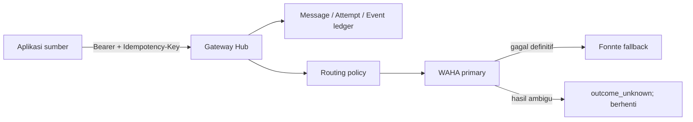

# WhatsApp Gateway Hub

Gateway Laravel terpusat untuk `appscript-ft`, `web-shelf`, `web-sam`, dan `web-helpdesk`. Aplikasi sumber cukup mengirim satu request ke Hub; pemilihan WAHA/Fonnte, urutan fallback, credential provider, serta riwayat percobaan dikelola di satu tempat.

## Cakupan MVP

- API Bearer token terpisah untuk setiap aplikasi.
- Idempotency key wajib agar request yang diulang tidak terkirim dua kali.
- Mode `sync` untuk OTP/transaksi yang harus menunggu provider menerima pesan.
- Mode `async` untuk notifikasi yang diproses worker.
- Banyak akun WAHA/Fonnte dengan routing dan fallback berurutan.
- Ledger pesan, attempt provider, latency, event, dan error yang sudah disanitasi.
- Status aman `outcome_unknown` untuk timeout/respons ambigu; Hub tidak melakukan fallback buta.
- Panel Filament untuk aplikasi, credential, provider, route, monitoring, dan retry yang aman.
- Recipient, isi pesan, metadata, serta konfigurasi provider terenkripsi di database; token aplikasi hanya disimpan sebagai hash.



## Menjalankan secara lokal

```bash
cp .env.example .env
composer install
php artisan key:generate
php artisan migrate
npm install
npm run build
php artisan gateway:create-admin \
  --name="Gateway Operator" \
  --email="operator@example.test" \
  --password="ganti-dengan-password-kuat"
```

Jalankan aplikasi dan worker pada proses terpisah:

```bash
php artisan serve
php artisan queue:work --tries=1 --timeout=360
```

`DB_QUEUE_RETRY_AFTER` harus lebih besar daripada timeout worker. Nilai contoh proyek adalah 420 detik.

## Konfigurasi awal

1. Masuk ke `/admin` memakai administrator yang dibuat lewat command.
2. Buat **Client Application**, lalu terbitkan API credential. Salin token saat ditampilkan; plaintext tidak dapat dilihat lagi.
3. Buat satu atau beberapa **Provider Account** WAHA/Fonnte.
4. Buat **Routing Policy** untuk aplikasi, `route_key`, dan `purpose`.
5. Susun provider steps sesuai prioritas fallback.

Jangan menyalin credential lama dari source code. Credential WAHA/Fonnte yang pernah tertanam di aplikasi lama harus dirotasi sebelum pilot.

## Mengirim pesan

Mode sinkron:

```bash
curl -X POST http://localhost:8000/api/v1/messages \
  -H 'Accept: application/json' \
  -H 'Authorization: Bearer wgh_CONTOH_TOKEN' \
  -H 'Idempotency-Key: otp-login-0001' \
  -H 'Content-Type: application/json' \
  -d '{
    "recipient": {"type": "phone", "value": "081234567890"},
    "message": {"type": "text", "text": "Kode OTP Anda: 123456"},
    "purpose": "otp",
    "mode": "sync",
    "route_key": "default",
    "expires_at": "2030-01-01T12:05:00+07:00",
    "client_reference": "otp-0001"
  }'
```

Untuk notifikasi asinkron, gunakan `"mode": "async"`. Hub mengembalikan HTTP 202 dengan status `queued`, lalu worker memprosesnya.

Status pesan milik aplikasi dapat dibaca melalui:

```bash
curl http://localhost:8000/api/v1/messages/UUID_PESAN \
  -H 'Accept: application/json' \
  -H 'Authorization: Bearer wgh_CONTOH_TOKEN'
```

## Arti status

| Status | Makna |
|---|---|
| `queued` | Sudah tersimpan dan menunggu worker. |
| `processing` | Sedang diproses oleh routing engine. |
| `provider_accepted` | Provider secara eksplisit menerima/menjadwalkan request; bukan klaim delivered/read. |
| `failed` | Gagal definitif dan aman ditinjau untuk retry manual jika belum kedaluwarsa. |
| `outcome_unknown` | Request mungkin sudah diterima provider; tidak boleh dikirim ulang otomatis. |
| `expired` | Batas waktu lewat sebelum provider dapat menerima. |

## Verifikasi

```bash
php artisan test
vendor/bin/pint --test
composer audit
```

Kontrak, model data, use case, dan traceability MVP tersedia di [`docs/chain-of-truth`](docs/chain-of-truth/).
