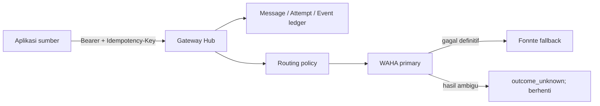

# WhatsApp Gateway Hub

Gateway Laravel terpusat untuk `appscript-ft`, `web-shelf`, `web-sam`, dan `web-helpdesk`. Aplikasi sumber cukup mengirim satu request ke Hub; pemilihan WAHA/Fonnte, urutan fallback, credential provider, serta riwayat percobaan dikelola di satu tempat.

## Cakupan MVP

- API Bearer token terpisah untuk setiap aplikasi.
- Idempotency key wajib agar request yang diulang tidak terkirim dua kali.
- Mode `sync` untuk OTP/transaksi yang harus menunggu provider menerima pesan.
- Mode `async` untuk notifikasi yang diproses worker.
- Banyak akun WAHA/Fonnte dengan routing dan fallback berurutan.
- Ledger pesan, attempt provider, latency, event, dan error yang sudah disanitasi.
- Status aman `outcome_unknown` untuk timeout/respons ambigu; Hub tidak melakukan fallback buta.
- Panel Filament untuk aplikasi, credential, provider, route, monitoring, dan retry yang aman.
- Recipient, isi pesan, metadata, serta konfigurasi provider terenkripsi di database; token aplikasi hanya disimpan sebagai hash.



## Menjalankan secara lokal

```bash
cp .env.example .env
composer install
npm ci
touch database/database.sqlite
php artisan key:generate
php artisan migrate
npm run build
php artisan gateway:create-admin
```

Command administrator akan meminta nama, email, dan password melalui prompt; password tidak perlu ditulis sebagai argumen shell.

Jalankan aplikasi, worker, dan scheduler pada proses terpisah:

```bash
php artisan serve
php artisan queue:work --tries=1 --timeout=360
php artisan schedule:work
```

`DB_QUEUE_RETRY_AFTER` harus lebih besar daripada timeout worker. Nilai contoh proyek adalah 420 detik.

Pada server pilot/production, kelola web process dan queue worker dengan process manager. Scheduler Laravel wajib dijalankan setiap menit, misalnya melalui cron `php artisan schedule:run`; scheduler ini merekonsiliasi proses stale dan mengantrekan ulang handoff queue yang sempat gagal.

## Allowlist endpoint provider

Hub hanya boleh menghubungi hostname provider yang didaftarkan secara eksplisit:

```dotenv
GATEWAY_PROVIDER_HTTPS_HOSTS=api.fonnte.com,waha.internal.example
GATEWAY_PROVIDER_HTTP_HOSTS=
GATEWAY_PROVIDER_FAILURE_THRESHOLD=3
GATEWAY_PROVIDER_CIRCUIT_SECONDS=300
```

- Tambahkan hostname WAHA yang benar ke allowlist HTTPS. Jangan menyalin contoh `waha.internal.example` apa adanya.
- HTTP biasa ditolak kecuali hostname dimasukkan ke `GATEWAY_PROVIDER_HTTP_HOSTS` secara eksplisit.
- `localhost`, literal private/loopback IP, metadata host, userinfo URL, subdomain yang tidak persis cocok, dan redirect tidak diikuti.
- Setelah mengubah konfigurasi: jalankan `php artisan config:cache`, lalu `php artisan queue:restart` agar worker memakai allowlist terbaru.

## Konfigurasi awal

1. Masuk ke `/admin` memakai administrator yang dibuat lewat command.
2. Buat **Client Application**, lalu terbitkan API credential. Salin token saat ditampilkan; plaintext tidak dapat dilihat lagi.
3. Buat satu atau beberapa **Provider Account** WAHA/Fonnte.
4. Buat **Routing Policy** untuk aplikasi, `route_key`, dan `purpose`.
5. Susun provider steps sesuai prioritas fallback.

Untuk pilot Shelf, gunakan aplikasi `web-shelf`, purpose `notification`, dan satu route key yang sama persis pada Hub dan konfigurasi Shelf. Panel menolak scope route yang sama dibuat dua kali.

Jangan menyalin credential lama dari source code. Credential WAHA/Fonnte yang pernah tertanam di aplikasi lama harus dirotasi sebelum pilot.

## Mengirim pesan

Mode sinkron:

```bash
curl -X POST http://localhost:8000/api/v1/messages \
  -H 'Accept: application/json' \
  -H 'Authorization: Bearer wgh_CONTOH_TOKEN' \
  -H 'Idempotency-Key: otp-login-0001' \
  -H 'Content-Type: application/json' \
  -d '{
    "recipient": {"type": "phone", "value": "081234567890"},
    "message": {"type": "text", "text": "Kode OTP Anda: 123456"},
    "purpose": "otp",
    "mode": "sync",
    "route_key": "default",
    "expires_at": "2030-01-01T12:05:00+07:00",
    "client_reference": "otp-0001"
  }'
```

Untuk notifikasi asinkron, gunakan `"mode": "async"`. Hub mengembalikan HTTP 202 dengan status `queued`, lalu worker memprosesnya.

Status pesan milik aplikasi dapat dibaca melalui:

```bash
curl http://localhost:8000/api/v1/messages/UUID_PESAN \
  -H 'Accept: application/json' \
  -H 'Authorization: Bearer wgh_CONTOH_TOKEN'
```

## Arti status

| Status | Makna |
|---|---|
| `queued` | Sudah tersimpan dan menunggu worker. |
| `processing` | Sedang diproses oleh routing engine. |
| `provider_accepted` | Provider secara eksplisit menerima/menjadwalkan request; bukan klaim delivered/read. |
| `failed` | Gagal definitif dan aman ditinjau untuk retry manual jika belum kedaluwarsa. |
| `outcome_unknown` | Request mungkin sudah diterima provider; tidak boleh dikirim ulang otomatis. |
| `expired` | Batas waktu lewat sebelum provider dapat menerima. |

Kegagalan definitif dapat berpindah ke provider berikutnya. Timeout, HTTP 5xx, atau respons ambigu menjadi `outcome_unknown` dan tidak memicu fallback untuk pesan tersebut. Kegagalan berulang tetap menurunkan health provider dan membuka circuit agar pesan baru dapat melewati provider yang sedang bermasalah.

## Mengaktifkan pilot web-shelf

Isi environment pada host Shelf, lalu recache konfigurasi:

```dotenv
WHATSAPP_HUB_BASE_URL=https://gateway.example.com
WHATSAPP_HUB_TOKEN=token-khusus-web-shelf
WHATSAPP_HUB_PURPOSE=notification
WHATSAPP_HUB_ROUTE_KEY=shelf-notifications
```

```bash
php artisan config:cache
```

Token Shelf cukup diberi ability `messages:send` (`messages:read` hanya bila Shelf perlu membaca status). Shelf tidak lagi membutuhkan credential WAHA/Fonnte. Reminder terjadwal menurunkan idempotency key dari identitas business event, sehingga timeout dan retry menggunakan pesan Hub yang sama.

## Checklist pilot

- Hub memakai `APP_ENV=production`, `APP_DEBUG=false`, `APP_URL` HTTPS, `APP_KEY` persisten dan dibackup.
- Database production, backup, web process, queue worker, dan scheduler aktif.
- Host WAHA/Fonnte sudah masuk allowlist dan worker telah direstart.
- Credential lama yang pernah tertanam di aplikasi/Apps Script sudah dirotasi.
- Satu smoke test nyata WAHA dan Fonnte diverifikasi dari ledger sebelum trafik aplikasi dialihkan.
- Adapter Shelf sudah masuk branch deployment (`staging`/`main`) dan environment Shelf telah direcache.

Retention/pruning otomatis dan webhook inbound/delivered/read belum termasuk MVP. Tentukan prosedur purge manual serta jaga endpoint inbound aplikasi lama tetap di jaringan tepercaya sampai fase autentikasi inbound dikerjakan.

## Verifikasi

```bash
php artisan test
vendor/bin/pint --test
composer audit
npm audit
npm run build
```

Coverage 80% dijalankan di CI/runtime yang menyediakan Xdebug atau PCOV.

Kontrak, model data, use case, dan traceability MVP tersedia di [`docs/chain-of-truth`](docs/chain-of-truth/).
