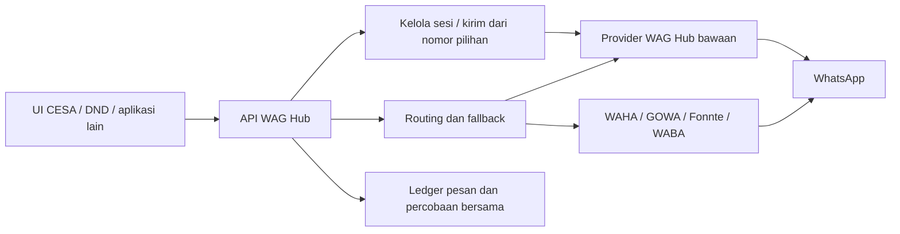

<p align="center">
  
</p>

<h1 align="center">WhatsApp Gateway Hub</h1>

<p align="center">
  Service WhatsApp mandiri dengan UI integrasi, provider bawaan, routing, dan fallback.
</p>

WAG Hub menyediakan provider WhatsApp sendiri melalui runner Baileys dan juga menjadi router untuk WAHA, GOWA, Fonnte, serta WABA. CESA, DND, dan aplikasi lain memakai API yang sama. UI login QR/pairing, status, dan logout dapat ditampilkan di aplikasi klien; socket, kredensial WhatsApp, dan riwayat pengiriman dikelola di WAG Hub.

Untuk memakai WhatsApp dari **CESA, DND, atau aplikasi lain**, buat Aplikasi
Klien lalu klik **Hubungkan aplikasi**. Salin `WAG_URL` dan `WAG_TOKEN` ke
backend aplikasi. WAG Hub mengelola login QR/pairing, logout, sesi, dan
pengiriman lewat `/api/v1/engine`; aplikasi klien tidak perlu menjalankan engine.
Lihat [panduan plug and play](docs/PLUG_AND_PLAY_GUIDE.md) dan
[migrasi CESA](docs/CESA_WEB.md).

Kirim melalui nomor yang dipilih di `/api/v1/engine/sessions/{id}/send`, atau
gunakan `/api/v1/messages` untuk memilih provider melalui routing/fallback.
Provider **WAG Hub (bawaan)** dapat menjadi utama maupun fallback, bersama
provider eksternal. Keduanya memakai ledger yang sama dan satu token aplikasi.

Panduan deploy production dari `git clone`: [docs/DEPLOYMENT_ID.md](docs/DEPLOYMENT_ID.md).
Untuk server 1Panel: [docs/DEPLOYMENT_1PANEL_ID.md](docs/DEPLOYMENT_1PANEL_ID.md).

## Cakupan MVP

- API Bearer token terpisah untuk setiap aplikasi.
- Idempotency key wajib agar request yang diulang tidak terkirim dua kali.
- Mode `sync` untuk OTP/transaksi yang harus menunggu provider menerima pesan.
- Mode `async` untuk notifikasi yang diproses worker.
- Banyak akun WAG Hub bawaan, WAHA, Fonnte, GOWA, dan WABA dengan routing dan fallback berurutan.
- Login QR/pairing, logout, pemulihan sesi, kirim teks, dan cek nomor melalui engine bawaan.
- Engine bawaan saat ini belum mendukung lampiran maupun webhook pesan masuk; gunakan provider eksternal yang mendukungnya untuk fitur tersebut.
- Ledger pesan, attempt provider, latency, event, dan error yang sudah disanitasi.
- Status aman `outcome_unknown` untuk timeout/respons ambigu; Hub tidak melakukan fallback buta.
- Panel Filament untuk aplikasi, credential, provider, route, monitoring, dan retry yang aman.
- Recipient, isi pesan, metadata, serta konfigurasi provider terenkripsi di database; token aplikasi hanya disimpan sebagai hash.



## Menjalankan secara lokal

```bash
cp .env.example .env
composer install
npm ci
touch database/database.sqlite
php artisan key:generate
php artisan migrate
npm run build
php artisan db:seed
```

`db:seed` membuat administrator default `admin@gateway.local` dengan password
`admin12345`. Nilai tersebut dapat diubah sebelum seed lewat
`GATEWAY_SEED_ADMIN_NAME`, `GATEWAY_SEED_ADMIN_EMAIL`, dan
`GATEWAY_SEED_ADMIN_PASSWORD` di `.env`.
Seeder menyiapkan aplikasi `appscript-ft`, `web-cesa`, `web-shelf`, `web-sam`, dan
`web-helpdesk`. Nama `appscript-ft` digunakan sebagai aplikasi Apps Script yang
tersedia di repository. Jika yang dimaksud adalah aplikasi lain, buat Client
Application baru dari panel.

Tambahkan kredensial provider dan token per aplikasi hanya bila ingin langsung
dipakai saat seed; semua nilai `GATEWAY_SEED_*` bersifat opsional selain tiga
nilai admin. Provider hanya diaktifkan bila konfigurasi lengkap. Tanpa credential, seeder tetap membuat akun
WAHA, Fonnte, GOWA, dan WABA serta route awal dalam status nonaktif agar dapat dilengkapi dari
panel. Seeder dapat dijalankan ulang dengan aman.
Untuk provisioning tanpa menyimpan password di `.env`, gunakan:

```bash
php artisan gateway:create-admin
```

Jalankan aplikasi, worker, dan scheduler pada proses terpisah:

```bash
php artisan serve
php artisan queue:work --tries=1 --timeout=360
php artisan schedule:work
```

`DB_QUEUE_RETRY_AFTER` harus lebih besar daripada timeout worker. Nilai contoh proyek adalah 420 detik.

Pada server pilot/production, kelola web process dan queue worker dengan process manager. Scheduler Laravel wajib dijalankan setiap menit, misalnya melalui cron `php artisan schedule:run`; scheduler ini merekonsiliasi proses stale dan mengantrekan ulang handoff queue yang sempat gagal.

## Allowlist endpoint provider

Hub hanya boleh menghubungi hostname provider yang didaftarkan secara eksplisit:

```dotenv
GATEWAY_PROVIDER_HTTPS_HOSTS=api.fonnte.com,graph.facebook.com,waha.internal.example,gowa.internal.example
GATEWAY_PROVIDER_HTTP_HOSTS=
GATEWAY_PROVIDER_FAILURE_THRESHOLD=3
GATEWAY_PROVIDER_CIRCUIT_SECONDS=300
```

- Tambahkan hostname WAHA/GOWA yang benar ke allowlist HTTPS. Jangan menyalin hostname contoh apa adanya.
- HTTP biasa ditolak kecuali hostname dimasukkan ke `GATEWAY_PROVIDER_HTTP_HOSTS` secara eksplisit.
- `localhost`, literal private/loopback IP, metadata host, userinfo URL, subdomain yang tidak persis cocok, dan redirect tidak diikuti.
- Setelah mengubah konfigurasi: jalankan `php artisan config:cache`, lalu `php artisan queue:restart` agar worker memakai allowlist terbaru.

## Konfigurasi awal

1. Masuk ke `/admin` memakai administrator yang dibuat lewat command.
2. Buat **Client Application**, lalu terbitkan API credential. Salin token saat ditampilkan; plaintext tidak dapat dilihat lagi.
3. Buat **Provider Account** WAG Hub bawaan, WAHA, Fonnte, GOWA, atau WABA. Untuk WAG Hub bawaan, jalankan runner sesuai [panduan](docs/PLUG_AND_PLAY_GUIDE.md), lalu tautkan nomor di **Perangkat WhatsApp**.
4. Buat **Routing Policy** untuk aplikasi, `route_key`, dan `purpose`.
5. Susun provider steps sesuai prioritas fallback.

## Seeder manajemen awal

`php artisan db:seed` membuat data administrasi yang konsisten untuk seluruh
aplikasi sumber. Provider aktif diurutkan WAHA, Fonnte, GOWA, lalu WABA pada
default route setiap aplikasi. Urutan dapat diubah dari panel. Route Shelf
bernama `shelf-notifications`; karena ia ditandai default, konfigurasi Shelf yang
masih memakai `WHATSAPP_HUB_ROUTE_KEY=default` tetap dapat menggunakan route ini.

Setiap `GATEWAY_SEED_*_TOKEN` membuat credential bernama `Seeded application
token` untuk aplikasi yang sesuai, dengan ability `messages:send` dan
`messages:read`. Token hanya disimpan sebagai hash; putar token bila pernah
tersimpan atau terekspos di file `.env`.

Untuk pilot Shelf, gunakan aplikasi `web-shelf`, purpose `notification`, dan satu route key yang sama persis pada Hub dan konfigurasi Shelf. Panel menolak scope route yang sama dibuat dua kali.

Jangan menyalin credential lama dari source code. Credential provider yang pernah tertanam di aplikasi lama harus dirotasi sebelum pilot.

### Catatan GOWA dan WABA

- GOWA memakai `POST /send/message`, Basic Auth, dan `X-Device-Id` opsional untuk server multi-device.
- WABA memakai Meta Cloud API resmi dengan Phone Number ID dan System User Access Token.
- Lookup registrasi nomor tersedia untuk WAG Hub bawaan, WAHA, Fonnte, dan GOWA. Meta WABA tidak menyediakan lookup penerima tanpa mengirim pesan, sehingga hasil WABA adalah `unsupported`.
- Driver WABA saat ini mengirim pesan teks bebas. Meta hanya mengizinkannya dalam customer-service window yang berlaku; pesan di luar window harus memakai template, yang belum menjadi bagian kontrak message Hub saat ini.
- `GATEWAY_SEED_WABA_API_VERSION` dapat dinaikkan tanpa perubahan kode ketika versi Graph API berubah.

## Mengirim pesan

Mode sinkron:

```bash
curl -X POST http://localhost:8000/api/v1/messages \
  -H 'Accept: application/json' \
  -H 'Authorization: Bearer wgh_CONTOH_TOKEN' \
  -H 'Idempotency-Key: otp-login-0001' \
  -H 'Content-Type: application/json' \
  -d '{
    "recipient": {"type": "phone", "value": "081234567890"},
    "message": {"type": "text", "text": "Kode OTP Anda: 123456"},
    "purpose": "otp",
    "mode": "sync",
    "route_key": "default",
    "expires_at": "2030-01-01T12:05:00+07:00",
    "client_reference": "otp-0001"
  }'
```

Untuk notifikasi asinkron, gunakan `"mode": "async"`. Hub mengembalikan HTTP 202 dengan status `queued`, lalu worker memprosesnya.

### Mengirim lampiran

Satu pesan boleh memiliki satu lampiran. Ada dua cara memasok file: upload ke
storage privat Hub, atau URL eksternal yang dapat diakses publik. Upload dibatasi
16 MB, diperiksa isi dan ekstensi, lalu dikembalikan sebagai UUID. File upload
disimpan sampai 90 hari sejak referensi kiriman terakhir; file yang tidak pernah
dipakai dibersihkan setelah 24 jam.

Upload terlebih dahulu memakai multipart `file`:

```bash
curl -X POST http://localhost:8000/api/v1/attachments \
  -H 'Accept: application/json' \
  -H 'Authorization: Bearer wgh_CONTOH_TOKEN' \
  -F 'file=@/path/INV-0001.pdf'
```

Gunakan `data.id` dari response upload pada `message.attachment.id`:

```json
{
  "message": {
    "type": "document",
    "text": "Terlampir invoice Anda.",
    "attachment": {"id": "UUID_ATTACHMENT"}
  }
}
```

Sebagai alternatif, ganti `message.type` menjadi `image`, `document`, `video`,
atau `audio`, lalu isi `message.attachment.url` dengan URL HTTP(S) publik.
`message.text` menjadi caption (opsional, maks 1.024 karakter; `audio` tidak
mendukung caption). `filename` dan `mime_type` opsional; bila kosong Hub
menurunkannya dari URL. `attachment.id` dan `attachment.url` wajib tepat salah
satu.

```bash
curl -X POST http://localhost:8000/api/v1/messages \
  -H 'Accept: application/json' \
  -H 'Authorization: Bearer wgh_CONTOH_TOKEN' \
  -H 'Idempotency-Key: invoice-0001' \
  -H 'Content-Type: application/json' \
  -d '{
    "recipient": {"type": "phone", "value": "081234567890"},
    "message": {
      "type": "document",
      "text": "Terlampir invoice Anda.",
      "attachment": {
        "url": "https://cdn.example.com/invoices/INV-0001.pdf",
        "filename": "INV-0001.pdf",
        "mime_type": "application/pdf"
      }
    },
    "purpose": "transactional",
    "mode": "async",
    "route_key": "default",
    "client_reference": "invoice-0001"
  }'
```

Lampiran berjalan lewat rute dan fallback yang sama dengan pesan teks. Pemetaan per provider:

| Jenis | WAHA | Fonnte | GOWA | WABA |
|---|---|---|---|---|
| `image` | `POST /api/sendImage` | `/send` + `url` | `POST /send/image` (`image_url`) | `type: image` + `link` |
| `document` | `POST /api/sendFile` | `/send` + `url`, `filename` | `POST /send/file` (`file_url`) | `type: document` + `link`, `filename` |
| `video` | `POST /api/sendVideo` | `/send` + `url` | `POST /send/video` (`video_url`) | `type: video` + `link` |
| `audio` | `POST /api/sendVoice` | `/send` + `url` | `POST /send/audio` (`audio_url`) | `type: audio` + `link` |

Batas Hub adalah 16 MB. Batas provider tetap berlaku: kebijakan awal Fonnte
4 MB (dapat dikonfigurasi per akun), WABA image 5 MB, WABA audio/video 16 MB,
dan WABA document 100 MB. WAHA audio harus OGG/Opus. URL dokumen GOWA
membutuhkan GOWA v8.10.0 atau lebih baru. Respons API menyertakan
`data.message_type` dan referensi attachment.

Status pesan milik aplikasi dapat dibaca melalui:

```bash
curl http://localhost:8000/api/v1/messages/UUID_PESAN \
  -H 'Accept: application/json' \
  -H 'Authorization: Bearer wgh_CONTOH_TOKEN'
```

## Mengecek nomor WhatsApp

Terbitkan credential dengan ability `numbers:check`. Buat **Aturan Rute** dengan
jenis alur **Cek nomor WhatsApp**. Rute ini terpisah dari rute **Kirim pesan**;
provider diperiksa berurutan dan berhenti ketika hasilnya sudah definitif.

```bash
curl -X POST http://localhost:8000/api/v1/number-checks \
  -H 'Accept: application/json' \
  -H 'Authorization: Bearer wgh_CONTOH_TOKEN' \
  -H 'Content-Type: application/json' \
  -d '{
    "recipient": {"type": "phone", "value": "081234567890"},
    "route_key": "default"
  }'
```

Hasil agregat:

| Status | Makna |
|---|---|
| `registered` | Sedikitnya satu provider memastikan nomor terdaftar, tanpa hasil negatif. |
| `not_registered` | Sedikitnya satu provider memastikan nomor tidak terdaftar, tanpa hasil positif. |
| `unknown` | Provider gagal, tidak tersedia, atau responsnya tidak dapat dipastikan. Bukan berarti nomor invalid. |
| `unsupported` | Seluruh provider pada rute tidak mendukung lookup tanpa efek samping. |

Respons juga berisi `checks` sesuai urutan percobaan provider. Client tidak dapat
memilih provider atau credential secara langsung. Pengecekan memiliki bucket
rate-limit sendiri sehingga tidak mengurangi kuota pengiriman pesan.

Setiap request valid memiliki `data.id` sebagai ID audit. Bila route/provider tidak
tersedia, ID yang sama dikembalikan melalui `error.audit_id`. Riwayat dapat dilihat
di **WhatsApp → Pengecekan Nomor** (`/panel/number-checks`) dan mencatat:

- aplikasi serta credential peminta;
- ID korelasi, route, waktu mulai dan selesai;
- nomor terenkripsi, hash pencarian, dan empat digit terakhir untuk tampilan;
- hasil akhir serta provider yang memberi hasil definitif;
- urutan attempt, status, kode alasan, HTTP status, dan latency setiap provider.

Audit pengecekan disimpan pada ledger tersendiri dan tidak membuat
`gateway_messages`, `message_attempts`, atau `message_events`.

## Arti status

| Status | Makna |
|---|---|
| `queued` | Sudah tersimpan dan menunggu worker. |
| `processing` | Sedang diproses oleh routing engine. |
| `provider_accepted` | Provider secara eksplisit menerima/menjadwalkan request; bukan klaim delivered/read. |
| `failed` | Gagal definitif dan aman ditinjau untuk retry manual jika belum kedaluwarsa. |
| `outcome_unknown` | Request mungkin sudah diterima provider; tidak boleh dikirim ulang otomatis. |
| `expired` | Batas waktu lewat sebelum provider dapat menerima. |

Kegagalan definitif dapat berpindah ke provider berikutnya. Timeout, HTTP 5xx, atau respons ambigu menjadi `outcome_unknown` dan tidak memicu fallback untuk pesan tersebut. Kegagalan berulang tetap menurunkan health provider dan membuka circuit agar pesan baru dapat melewati provider yang sedang bermasalah.

## Mengaktifkan pilot web-shelf

Isi environment pada host Shelf, lalu recache konfigurasi:

```dotenv
WHATSAPP_HUB_BASE_URL=https://gateway.example.com
WHATSAPP_HUB_TOKEN=token-khusus-web-shelf
WHATSAPP_HUB_PURPOSE=notification
WHATSAPP_HUB_ROUTE_KEY=shelf-notifications
```

```bash
php artisan config:cache
```

Token Shelf cukup diberi ability `messages:send` (`messages:read` hanya bila Shelf perlu membaca status). Shelf tidak membutuhkan credential provider. Reminder terjadwal menurunkan idempotency key dari identitas business event, sehingga timeout dan retry menggunakan pesan Hub yang sama.

## Checklist pilot

- Hub memakai `APP_ENV=production`, `APP_DEBUG=false`, `APP_URL` HTTPS, `APP_KEY` persisten dan dibackup.
- Database production, backup, web process, queue worker, dan scheduler aktif.
- Semua host provider terpilih sudah masuk allowlist dan worker telah direstart.
- Credential lama yang pernah tertanam di aplikasi/Apps Script sudah dirotasi.
- Satu smoke test nyata untuk setiap provider aktif diverifikasi dari ledger sebelum trafik aplikasi dialihkan.
- Adapter Shelf sudah masuk branch deployment (`staging`/`main`) dan environment Shelf telah direcache.

Cleanup attachment otomatis berjalan melalui scheduler: upload yang tidak pernah dipakai dihapus setelah 24 jam dan file terpakai setelah 90 hari sejak referensi terakhir. Webhook inbound/delivered/read belum termasuk MVP; jaga endpoint inbound aplikasi lama tetap di jaringan tepercaya sampai fase autentikasi inbound dikerjakan.

## Verifikasi

```bash
php artisan test
vendor/bin/pint --test
composer audit
npm audit
npm run build
```

Coverage 80% dijalankan di CI/runtime yang menyediakan Xdebug atau PCOV.

Kontrak, model data, use case, dan traceability MVP tersedia di [`docs/chain-of-truth`](docs/chain-of-truth/).
