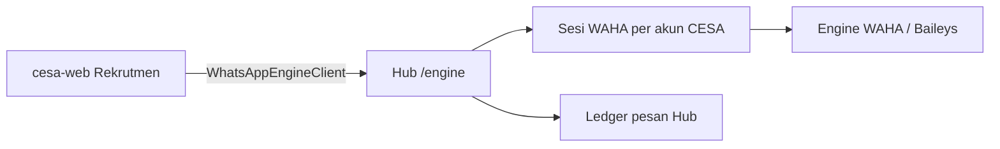

# Integrasi cesa-web

[cesa-web](https://github.com/oceanspacedev/cesa-web) tidak perlu menjalankan
engine Baileys sendiri. Plugin Rekrutmen sudah berbicara ke kontrak HTTP
engine lokal (`GET /health`, `POST /sessions`, kirim teks, logout). Hub
mengekspos kontrak yang sama dan mengarahkannya ke engine WAHA/Baileys
yang sudah ada di repositori ini.



## Yang berubah di cesa-web

Tidak perlu Node `whatsapp-engine`, `php artisan rekrutmen:whatsapp-engine`,
atau `REKRUTMEN_WHATSAPP_ENGINE_AUTO_START=true`.

Di `.env` cesa-web:

```dotenv
WAG_URL=https://gateway.example.com
WAG_TOKEN=wgh_token_web_cesa
REKRUTMEN_WHATSAPP_ENGINE_URL="${WAG_URL}/engine/t/${WAG_TOKEN}"
REKRUTMEN_WHATSAPP_ENGINE_AUTO_START=false
```

`WhatsAppEngineClient` tidak mengirim header `Authorization`. Token dimasukkan
di path `/engine/t/{token}` agar drop-in. Bearer di `/engine` juga didukung
bila client CESA nanti menambahkan header.

Matikan auto-start supaya CESA tidak mencoba spawn `node server.mjs` lokal.

## Yang disiapkan di Hub

1. Aplikasi klien `web-cesa` (sudah di-seed).
2. Kredensial dengan `messages:send` (seeder menambahkan juga `engine:use`).
3. Akun provider **WAHA** aktif (`waha-primary` atau `GATEWAY_CESA_WAHA_SLUG`)
   dengan base URL + API key yang menunjuk ke engine di `engine/`.
4. Host engine masuk allowlist (`GATEWAY_PROVIDER_HTTP_HOSTS` atau HTTPS).
5. Engine WAHA berjalan (`docker compose -f engine/docker-compose.yml up -d`
   atau mock `engine/mock-waha` untuk uji pairing).

Setiap akun WhatsApp CESA (`session_id` = `rekrutmen-{id}`) menjadi satu sesi
WAHA + satu Akun Provider Hub (`{slug-aplikasi}-sess-{session_id}`) + satu
aturan rute dengan `route_key` yang sama. Pengiriman dipin ke nomor itu,
bukan fallback antar provider.

## Kontrak yang ditiru

| CESA | Hub |
|---|---|
| `GET /health` | Engine hidup. `ok: true` cukup agar CESA anggap siap. |
| `POST /sessions` `{id, mode, phone?}` | Mulai QR atau pairing code. |
| `GET /sessions/{id}` | Status: `qr`, `pairing`, `connecting`, `connected`, `disconnected`. |
| `DELETE /sessions/{id}` `{logout}` | Logout perangkat. |
| `POST /sessions/{id}/send` `{phone, text, idempotency_key}` | Kirim teks sync lewat ledger Hub. |
| `GET /sessions/{id}/messages/{key}` | Status idempoten `sent` / `failed` / `unknown`. |

Status kirim: `sent` = Hub `provider_accepted`; `unknown` = hasil ambigu
(jangan retry buta); `failed` + `retryable` hanya bila aman.

## Alternatif: API Hub biasa

CESA juga bisa memanggil `POST /api/v1/messages` dengan Bearer `WAG_TOKEN`
dan `route_key=web-cesa-messages` tanpa UI pairing. Engine `/engine`
diperlukan supaya panel WhatsApp Rekrutmen (QR, multi-nomor) tetap jalan
tanpa engine Node di cesa-web.
