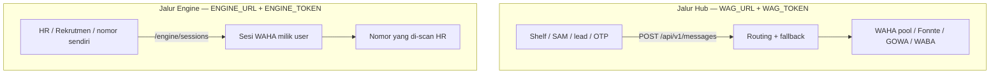

# Dua jalur WhatsApp: Hub API vs Engine

WAG Hub punya **dua produk yang tidak saling menggantikan**. Jangan campur
token-nya.



| | Hub API | Engine |
|---|---|---|
| Env | `WAG_URL` + `WAG_TOKEN` | `ENGINE_URL` + token engine |
| Ability | `messages:send` / `read` / `numbers:check` | `engine:use` saja |
| Nomor pengirim | Yang diset developer di panel (pool + fallback) | Nomor yang **user tautkan sendiri** (QR/pairing) |
| Fallback | Ya — provider berikutnya jika gagal definitif | Tidak — hanya nomor sesi itu |
| Pakai untuk | Notifikasi sistem, OTP, cek nomor lead | Rekrutmen, CS tim, WA pribadi HR |

Token Hub **ditolak** di `/engine`. Token engine **ditolak** di `/api/v1/messages`.

## Setup

1. `/panel/client-applications` → Kredensial API → **Buat WAG_TOKEN & ENGINE_URL**.
2. Tempel blok itu ke `.env` cesa-web (atau helpdesk/SAM). `REKRUTMEN_WHATSAPP_ENGINE_AUTO_START=false`.
3. QR: `POST /engine/sessions` dari `WhatsAppEngineClient`, atau `/panel/devices` → Hubungkan.

`/panel/devices` membagi host WAHA (slug tanpa `-sess-`) dan sesi `/engine` (`{app}-sess-{id}`).

## Jalur Hub (tetap seperti semula)

Aplikasi sumber memanggil API ledger. Developer menyiapkan provider dan
`route_key`. Contoh CESA untuk cek nomor / kirim lewat pool:

```dotenv
WAG_URL=https://gateway.example.com
WAG_TOKEN=wgh_token_hub_cesa
```

```http
POST /api/v1/messages
Authorization: Bearer wgh_token_hub_cesa
Idempotency-Key: ...
```

Rekrutmen **jangan** memakai token ini untuk mengirim undangan dari nomor HR.

## Jalur Engine (nomor yang di-link user)

HR di Rekrutmen ingin memakai WhatsApp miliknya, bukan nomor yang sudah
dipasang developer. CESA tetap memakai `WhatsAppEngineClient` (kontrak
`/health`, `/sessions`, `/send`), tetapi menunjuk ke Hub — **bukan** ke
`WAG_URL` dan **bukan** ke Node lokal.

Di Hub: terbitkan kredensial terpisah, ability hanya `engine:use`.

Di `.env` cesa-web:

```dotenv
# Jalur Hub (lead / fallback / API biasa) — jangan dipakai Rekrutmen kirim WA HR
WAG_URL=https://gateway.example.com
WAG_TOKEN=wgh_token_hub_cesa

# Jalur Engine (QR, pairing, kirim dari nomor yang di-scan)
REKRUTMEN_WHATSAPP_ENGINE_URL=https://gateway.example.com/engine/t/wgh_token_engine_cesa
REKRUTMEN_WHATSAPP_ENGINE_AUTO_START=false
```

`WhatsAppEngineClient` tidak mengirim header Authorization, jadi token engine
masuk path `/engine/t/{token}`. Bearer ke `/engine` juga valid jika client
mengirim header.

Matikan auto-start supaya CESA tidak menjalankan `node server.mjs` lokal.

### Perilaku sesi

1. User Rekrutmen klik Hubungkan → `POST /engine/sessions` `{ id: rekrutmen-12, mode: qr }`.
2. Hub membuat sesi WAHA khusus (`web-cesa-sess-rekrutmen-12`) di host engine.
3. User scan QR / masukkan pairing code dari HP-nya.
4. `POST /engine/sessions/rekrutmen-12/send` dkirim **hanya** dari nomor itu.
   Pool Fonnte/WABA/route `web-cesa-messages` tidak dipakai.

## Setup Hub untuk engine

1. Aplikasi klien (mis. `web-cesa`).
2. Dua kredensial: token Hub (`messages:*`) dan token Engine (`engine:use`).
   Seeder: `GATEWAY_SEED_WEB_CESA_TOKEN` vs `GATEWAY_SEED_WEB_CESA_ENGINE_TOKEN`.
3. Satu akun provider **WAHA** sebagai **host** (base URL + API key). Ini mesin
   engine, bukan “nomor default perusahaan”.
4. Host WAHA masuk allowlist. Jalankan `engine/docker-compose.yml` (atau mock).

## Kontrak engine

| Method | Makna |
|---|---|
| `GET /health` | Engine siap. CESA cek `ok: true`. |
| `POST /sessions` `{id, mode, phone?}` | Mulai QR atau pairing. |
| `GET /sessions/{id}` | `qr` / `pairing` / `connecting` / `connected` / `disconnected`. |
| `DELETE /sessions/{id}` | Logout perangkat user. |
| `POST /sessions/{id}/send` | Kirim teks dari nomor sesi itu. |
| `GET /sessions/{id}/messages/{key}` | Status idempoten `sent` / `failed` / `unknown`. |
