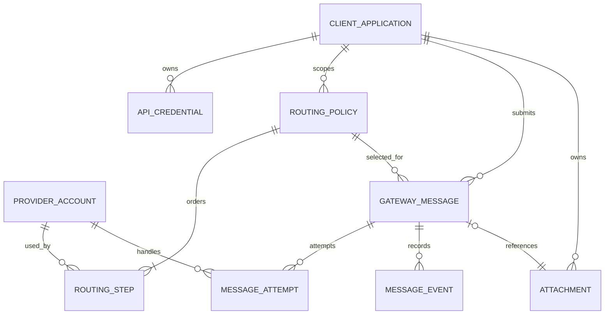

# Data Model — WhatsApp Gateway Hub

Status: Reviewed  
Derived from: UC-001–UC-004 0.1.0 (implementation exception approved)

## Domain overview

Enam konteks saling terhubung: Client Access (`ClientApplication`, `ApiCredential`), Attachment Storage (`Attachment`), Provider Configuration (`ProviderAccount`), Routing (`RoutingPolicy`, `RoutingStep`), Delivery Ledger (`GatewayMessage`, `MessageAttempt`, `MessageEvent`), dan Number Check Ledger (`NumberCheckRequest`, `NumberCheckAttempt`). Queue job hanya membawa message ID; plaintext body dan credential dibaca oleh worker pada saat diperlukan.

## Entities

### ENT-001 — ClientApplication

Purpose: Identitas dan batas isolasi aplikasi sumber.  
Used by: UC-001, UC-002, UC-003, UC-004

| Field | Type | Required | Validation/default | Sensitivity |
|---|---|---|---|---|
| id | bigint | yes | PK | Internal |
| uuid | uuid | yes | unique, generated | Public identifier |
| name | string(120) | yes | human-readable | Internal |
| slug | string(80) | yes | unique, lowercase | Internal |
| is_active | boolean | yes | true | Internal |
| rate_limit_per_minute | unsigned int | yes | 1–6000, default 60 | Internal |
| timestamps/deleted_at | datetime | yes/no | soft delete | Internal |

### ENT-002 — ApiCredential

Purpose: Machine credential yang dapat dirotasi/revoke tanpa mengganti aplikasi.  
Used by: UC-001, UC-002, UC-003

| Field | Type | Required | Validation/default | Sensitivity |
|---|---|---|---|---|
| id, uuid | bigint, uuid | yes | PK + unique | Internal/public ID |
| client_application_id | FK | yes | ENT-001 | Internal |
| name | string(120) | yes | unique per app | Internal |
| token_hash | char(64) | yes | unique SHA-256 | Secret-derived |
| token_prefix | string(16) | yes | display only | Internal |
| abilities | encrypted JSON/text | yes | default `messages:send/read` | Sensitive |
| last_used_at, expires_at, revoked_at | datetime | no | nullable | Internal |
| timestamps | datetime | yes | automatic | Internal |

Plaintext token tidak menjadi field dan hanya hidup pada response create/rotate.

### ENT-003 — ProviderAccount

Purpose: Satu koneksi/session WAHA atau akun Fonnte yang dapat menjadi route step.  
Used by: UC-001, UC-002, UC-003, UC-004

| Field | Type | Required | Validation/default | Sensitivity |
|---|---|---|---|---|
| id, uuid | bigint, uuid | yes | PK + unique | Internal/public ID |
| name, slug | string | yes | slug unique | Internal |
| driver | enum string | yes | `waha`, `fonnte`, `gowa`, or `waba` | Internal |
| configuration | encrypted text | yes | validated per driver; endpoint + credential | Secret |
| is_active | boolean | yes | true | Internal |
| health_status | enum string | yes | unknown/healthy/degraded/unavailable | Internal |
| consecutive_failures | unsigned int | yes | 0 | Internal |
| circuit_open_until | datetime | no | nullable | Internal |
| timeout_seconds | unsigned int | yes | 1–60, default 15 | Internal |
| timestamps/deleted_at | datetime | yes/no | soft delete | Internal |

Endpoint harus melewati validation/allowlist deployment; arbitrary private/metadata address ditolak untuk mengurangi SSRF.

### ENT-004 — RoutingPolicy

Purpose: Memetakan aplikasi + route key/purpose ke urutan provider.  
Used by: UC-001, UC-002, UC-003

| Field | Type | Required | Validation/default | Sensitivity |
|---|---|---|---|---|
| id, uuid | bigint, uuid | yes | PK + unique | Internal/public ID |
| client_application_id | FK | no | null = global | Internal |
| operation | string(24) | yes | message/number_check | Internal |
| name | string(120) | yes | required | Internal |
| key | string(80) | yes | unique per application scope | Internal |
| purpose | string(40) | no | otp/transactional/notification/null | Internal |
| is_default, is_active | boolean | yes | false/true | Internal |
| timestamps/deleted_at | datetime | yes/no | soft delete | Internal |

### ENT-005 — RoutingStep

Purpose: Ordered provider account dalam satu policy.  
Used by: UC-001, UC-002, UC-003

| Field | Type | Required | Validation/default | Sensitivity |
|---|---|---|---|---|
| id | bigint | yes | PK | Internal |
| routing_policy_id | FK | yes | ENT-004 | Internal |
| provider_account_id | FK | yes | ENT-003 | Internal |
| position | unsigned int | yes | >=1, unique per policy | Internal |
| is_active | boolean | yes | true | Internal |
| timestamps | datetime | yes | automatic | Internal |

### ENT-006 — GatewayMessage

Purpose: Durable request dan lifecycle agregat satu pesan.  
Used by: UC-001, UC-002, UC-004

| Field | Type | Required | Validation/default | Sensitivity |
|---|---|---|---|---|
| id | bigint | yes | PK | Internal |
| uuid | uuid | yes | unique/public | Public ID |
| client_application_id | FK | no | ENT-001; null for dashboard/Inbox messages | Internal |
| routing_policy_id | FK | no | selected policy snapshot reference | Internal |
| accepted_provider_account_id | FK | no | provider accepted | Internal |
| idempotency_key | string(160) | yes | unique with application | Sensitive reference |
| inbox_submission_uuid | UUID | no | unique for Inbox dashboard submissions; null for API messages | Internal |
| payload_hash | char(64) | yes | hash of canonical payload | Internal |
| correlation_id | uuid/string | yes | generated/client-safe | Public tracing |
| client_reference | string(160) | no | optional, bounded | Sensitive reference |
| recipient | encrypted text | yes | canonical phone | PII secret |
| recipient_hash | char(64) | yes | keyed HMAC | Sensitive-derived |
| recipient_last4 | char(4) | yes | masked display | PII limited |
| body | encrypted long text | yes | text: 1–10,000 chars; attachment caption: 0–1,024 chars (empty string when no caption) | Message secret |
| message_type | string(16) | yes | text/image/document/video/audio, default `text` | Internal/public |
| attachment | encrypted text (JSON) | no | `{id, kind, filename, mime_type, size}` for private upload or `{kind, url, filename, mime_type}` for external URL; null for text messages. Signed URL is generated per attempt and is never hashed. | Message secret |
| purpose | string(40) | yes | otp/transactional/notification | Internal |
| route_key | string(80) | yes | default `default` | Internal |
| mode | string(16) | yes | sync/async | Internal |
| priority | unsigned tiny int | yes | derived from purpose | Internal |
| status | string(32) | yes | state machine | Internal/public |
| metadata | encrypted text | no | bounded JSON | Sensitive |
| provider_message_id | string(255) | no | remote ID | Internal |
| last_error_code/message | string/encrypted text | no | sanitized; message encrypted at rest | Sensitive/internal |
| expires_at | datetime | required for otp | future, bounded | Internal |
| queued_at, processing_at, provider_accepted_at, failed_at, outcome_unknown_at, dead_lettered_at | datetime | no | lifecycle | Internal |
| timestamps | datetime | yes | automatic | Internal |

### ENT-007 — MessageAttempt

Purpose: Append-oriented record satu panggilan provider.  
Used by: UC-001, UC-002, UC-004

| Field | Type | Required | Validation/default | Sensitivity |
|---|---|---|---|---|
| id | bigint | yes | PK | Internal |
| gateway_message_id | FK | yes | ENT-006 | Internal |
| provider_account_id | FK | yes | ENT-003 | Internal |
| sequence | unsigned int | yes | unique per message | Internal |
| status | string(32) | yes | started/accepted/rejected/provider_failed/outcome_unknown/skipped | Internal |
| delivery_certainty | string(16) | yes | not_sent/accepted/unknown | Internal |
| retry_disposition | string(24) | yes | fallback_allowed/do_not_retry/reconcile_only | Internal |
| http_status | unsigned int | no | nullable | Internal |
| provider_message_id | string(255) | no | sanitized | Internal |
| latency_ms | unsigned int | no | nullable | Internal |
| error_code, error_message | string/text | no | normalized/sanitized | Internal |
| response_excerpt | encrypted text | no | sanitized, bounded, short retention | Sensitive |
| started_at, finished_at | datetime | yes/no | lifecycle | Internal |
| timestamps | datetime | yes | automatic | Internal |

### ENT-008 — MessageEvent

Purpose: Append-only timeline perubahan status dan routing.  
Used by: UC-001, UC-002, UC-004

| Field | Type | Required | Validation/default | Sensitivity |
|---|---|---|---|---|
| id | bigint | yes | PK | Internal |
| gateway_message_id | FK | yes | ENT-006 | Internal |
| type | string(64) | yes | controlled vocabulary | Internal/public |
| source | string(32) | yes | api/worker/provider/admin/system | Internal |
| data | encrypted text | no | sanitized bounded JSON | Sensitive |
| occurred_at | datetime | yes | now/provider timestamp | Internal |
| created_at | datetime | yes | append timestamp | Internal |

### ENT-009 — NumberCheckRequest

Purpose: Audit agregat satu request pengecekan registrasi nomor tanpa membuat pesan.
Used by: Number check API

| Field | Type | Required | Validation/default | Sensitivity |
|---|---|---|---|---|
| id, uuid | bigint, uuid | yes | PK + unique/public audit ID | Internal/public ID |
| client_application_id, api_credential_id | FK | yes | requester identity | Internal |
| routing_policy_id, resolved_provider_account_id | FK | no | selected route/final provider | Internal |
| correlation_id, route_key | string | yes | bounded | Public/internal |
| recipient | encrypted text | yes | canonical phone | PII secret |
| recipient_hash, recipient_last4 | char(64)/char(4) | yes | keyed HMAC/masked display | Sensitive-derived |
| status | string(32) | yes | processing/registered/not_registered/unknown/unsupported/failed | Internal/public |
| registered | boolean | no | definitive result or null | Internal/public |
| last_error_code | string(120) | no | normalized | Internal |
| started_at, finished_at, timestamps | datetime | yes/no | lifecycle | Internal |

### ENT-010 — NumberCheckAttempt

Purpose: Append-oriented audit setiap provider yang diperiksa atau dilewati.
Used by: Number check API

| Field | Type | Required | Validation/default | Sensitivity |
|---|---|---|---|---|
| id | bigint | yes | PK | Internal |
| number_check_request_id, provider_account_id | FK | yes | audit/provider | Internal |
| sequence | unsigned int | yes | unique per request | Internal |
| status | string(32) | yes | registered/not_registered/unknown/unsupported/skipped | Internal |
| registered | boolean | no | provider result or null | Internal |
| http_status, latency_ms | unsigned int | no | transport metrics | Internal |
| reason_code | string(120) | no | normalized; no raw response | Internal |
| started_at, finished_at, timestamps | datetime | yes | lifecycle | Internal |

### Attachment Storage — Attachment

Purpose: Metadata dan objek privat yang dapat direferensikan satu kali atau lebih oleh pesan API/Inbox.

| Field | Type | Required | Validation/default | Sensitivity |
|---|---|---|---|---|
| id, uuid | bigint, uuid | yes | PK + unique/public upload ID | Internal/public ID |
| client_application_id | FK | no | owner API; null for dashboard uploads | Internal |
| user_id | FK | no | owner administrator; null for API uploads | Internal |
| disk, path | string | yes | private disk, random storage name | Sensitive/internal |
| original_filename | string(255) | yes | sanitized display name | Internal |
| mime_type, media_kind | string | yes | file inspection + supported image/document/video/audio | Internal |
| size, checksum | unsigned bigint, char(64) | yes | <=16 MB, SHA-256 | Internal |
| status | string | yes | active/expired | Internal |
| last_referenced_at, expires_at, deleted_at | datetime | no | orphan 24h; used retention 90d after terminal message | Internal |

## Relationships

| From | Relationship | To | Cardinality | Rule |
|---|---|---|---|---|
| ENT-001 | owns | ENT-002 | 1:N | Revoked credential tetap menjadi audit reference |
| ENT-001 | scopes | ENT-004 | 1:N | null app pada policy berarti global |
| ENT-004 | orders | ENT-005 | 1:N | position unique dan ascending |
| ENT-003 | participates through | ENT-005 | 1:N | hanya account aktif/circuit closed yang dipakai |
| ENT-001 | creates | ENT-006 | 1:N | idempotency unique per app |
| ENT-006 | records | ENT-007 | 1:N | sequence append-only |
| ENT-006 | records | ENT-008 | 1:N | event append-only |
| ENT-001/002 | requests through | ENT-009 | 1:N | application and credential remain traceable |
| ENT-009 | records | ENT-010 | 1:N | provider sequence append-oriented |
| Attachment | owned by | ENT-001 or administrator | 1:1 | Exactly one owner scope; API cannot access dashboard files and vice versa |
| ENT-006 | references | Attachment | 0:1 per message | Stable attachment ID is encrypted in the message; signed URL is derived per attempt |
| ENT-003 | participates through | ENT-010 | 1:N | result or skip reason is retained |

## State transitions

```text
async: queued -> processing -> provider_accepted | failed | outcome_unknown | expired
sync:  processing -> provider_accepted | failed | outcome_unknown | expired
manual safe retry: failed -> queued
queue handoff recovery: queued + enqueue_failed -> enqueue_recovered
```

- `provider_accepted`, `outcome_unknown`, dan `expired` tidak otomatis retry.
- Attempt `provider_failed + fallback_allowed` dan `rejected + fallback_allowed` dapat diikuti attempt berikutnya.
- Attempt `outcome_unknown + reconcile_only` menghentikan route.
- `fallback` dan `retry` adalah event, bukan status message utama.

## Persistence and lifecycle

- Insert idempotent message memakai transaksi + unique `(client_application_id, idempotency_key)`; duplicate race membaca record pemenang dan membandingkan `payload_hash`.
- Job dispatch dilakukan setelah transaksi intake/retry selesai. Kegagalan handoff dicatat sebagai `enqueue_failed` dan recovery command mencoba kembali hingga `enqueue_recovered`.
- Provider call tidak berada dalam transaksi database panjang. Attempt `started` disimpan lebih dulu; crash setelah itu diperlakukan outcome tidak pasti saat rekonsiliasi.
- Processing stale tanpa attempt direqueue untuk async dan ditutup sebagai failed-safe untuk sync; started attempt stale tidak pernah dikirim ulang otomatis.
- Foreign record konfigurasi memakai soft delete; delivery ledger tidak cascade-delete.
- Index utama: message `(app,status,created_at)`, `(recipient_hash,created_at)`, attempt `(message,sequence)`, policy `(app,key,purpose,is_active)`.
- Attachment upload menyimpan objek privat dengan checksum, MIME hasil pemeriksaan, owner, dan status. File yang belum pernah direferensikan dihapus setelah 24 jam; file terpakai dipertahankan 90 hari sejak referensi terakhir.
- Provider dan dashboard memakai signed URL 24 jam; GET, HEAD, dan Range tersedia melalui route signed. Metadata dan ledger tetap disimpan setelah file kedaluwarsa.

## Diagram/schema



## Validation record

Setiap data read/write pada UC-001–UC-004 tercakup. Model berstatus Reviewed; exception implementasi mengikuti persetujuan MVP. Retensi attachment mengikuti konfigurasi deployment (default 90 hari).
