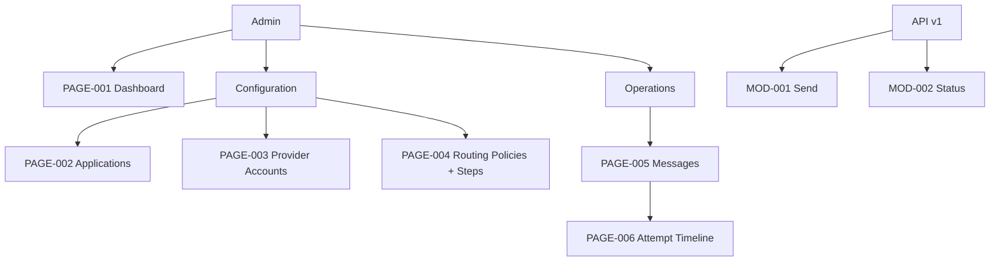

# Information Architecture — WhatsApp Gateway Hub

Status: Reviewed  
Derived from: SRS 0.1.0, FR-011–FR-013

## Navigation model

Panel admin memakai navigasi berbasis operasi: ringkasan kesehatan, konfigurasi, lalu observability. API tidak memiliki UI bagi client application; client memakai endpoint versioned.

## Page and module inventory

| ID | Page/module | Route or entry | Actor | Parent | Supports |
|---|---|---|---|---|---|
| PAGE-001 | Dashboard gateway | `/admin` | ACT-002 | Root | UC-003, UC-004 |
| PAGE-002 | Client Applications | `/admin/client-applications` | ACT-002 | Configuration | UC-003 |
| PAGE-003 | Provider Accounts | `/admin/provider-accounts` | ACT-002 | Configuration | UC-003 |
| PAGE-004 | Routing Policies | `/admin/routing-policies` | ACT-002 | Configuration | UC-003 |
| PAGE-005 | Messages | `/admin/messages` | ACT-002 | Operations | UC-004 |
| PAGE-006 | Message detail/timeline | `/admin/messages/{record}` | ACT-002 | PAGE-005 | UC-004 |
| MOD-001 | Send Message API | `POST /api/v1/messages` | ACT-001 | API v1 | UC-001, UC-002 |
| MOD-002 | Message Status API | `GET /api/v1/messages/{id}` | ACT-001 | API v1 | UC-001, UC-002 |

## Hierarchy

## Cross-cutting states

- Loading memakai skeleton/spinner standar Filament; submit/action dinonaktifkan saat berjalan.
- Empty state menjelaskan tindakan berikutnya, misalnya membuat provider sebelum route.
- Error configuration menampilkan pesan aman tanpa credential/raw response.
- Status message selalu memakai label + warna, bukan warna saja.
- Unauthorized diarahkan ke login; authenticated non-admin menerima 403.
- Halaman tetap dapat dipakai pada viewport mobile, tetapi pengelolaan route step dioptimalkan untuk desktop.

## Validation record

Struktur ditinjau terhadap empat kebutuhan operasi utama. HiFi kustom tidak dibuat; Filament 4 menjadi prototype executable dan akan diverifikasi setelah resource tersedia.
