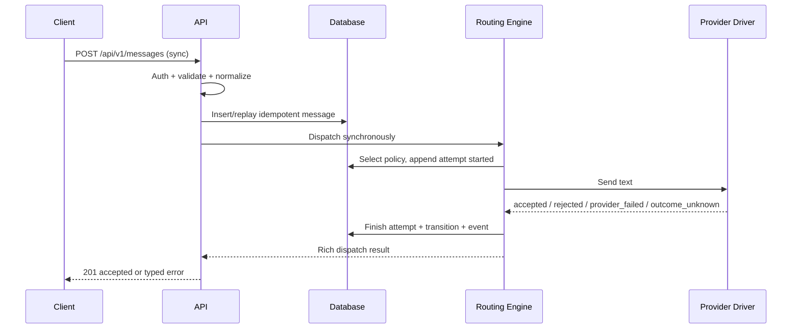

# UCIC UC-001 — Send text synchronously

Status: Reviewed  
Derived from: UC-001 0.1.0 and ENT-001–ENT-008

## Scope

- Actor: ACT-001 Client application
- Related pages: MOD-001, MOD-002
- Related entities: ENT-001–ENT-008
- Authentication/authorization: Active Bearer credential with `messages:send`; status read requires `messages:read` and same application ownership.

## Sequence



## Interface contract

| API/operation ID | Method/event | Path/topic/function | Auth | Idempotency |
|---|---|---|---|---|
| API-001 | POST | `/api/v1/messages` | Bearer `messages:send` | Required header, scoped per application |
| API-002 | GET | `/api/v1/messages/{uuid}` | Bearer `messages:read` | Read-only |
| INT-001 | Function | `ProviderDriver::send(ProviderAccount, OutboundMessage): ProviderResult` | Internal | Exactly one attempt context; text or one attachment |

### Request/input

Headers: `Authorization`, `Idempotency-Key`, optional `X-Correlation-ID`.

```json
{
  "recipient": {"type": "phone", "value": "081234567890"},
  "message": {"type": "text", "text": "Kode OTP Anda: 123456"},
  "purpose": "otp",
  "mode": "sync",
  "route_key": "default",
  "expires_at": "2026-07-15T12:01:00+07:00",
  "client_reference": "otp-issuance-uuid",
  "metadata": {"entity_type": "login_otp"}
}
```

Rules: one recipient; individual phone only; text 1–10,000 chars; OTP requires future `expires_at`; metadata maximum 20 keys/8 KB and must not be used for secrets.

### Success output

First accepted dispatch: HTTP 201.

```json
{
  "data": {
    "id": "uuid",
    "status": "provider_accepted",
    "mode": "sync",
    "provider": "waha-primary",
    "provider_message_id": "remote-id",
    "duplicate": false,
    "created_at": "ISO-8601",
    "provider_accepted_at": "ISO-8601"
  },
  "request_id": "uuid"
}
```

Replay dengan fingerprint sama: HTTP 200, `duplicate=true`, ID/status resource saat ini. Provider credential dan raw response tidak pernah muncul.

### Error outputs

| Condition | Status/code | Response | Recovery |
|---|---|---|---|
| Token invalid/revoked/app inactive | 401 `unauthenticated` | Common envelope | Rotate/fix credential |
| Ability missing | 403 `forbidden` | Common envelope | Grant proper credential |
| Invalid payload/phone/expiry | 422 `validation_failed` | field errors | Fix request; reuse key only if no message created |
| Same key, different canonical payload | 409 `idempotency_conflict` | original message ID | Use original payload or new key |
| No route/provider | 503 `route_unavailable` | message status failed | Admin configures route then safe retry |
| All safe fallback steps failed | 503 `providers_failed` | message status failed | Retry later/manual |
| Outcome cannot be known | 502 `provider_outcome_unknown` | message status outcome_unknown | Reconcile; do not blindly resend |
| Expired | 410 `message_expired` | message status expired | Create fresh business request/key |

## Data mapping

| UI/input | Request field | Domain field | Response/output | Transform |
|---|---|---|---|---|
| Phone | `recipient.value` | ENT-006.recipient/hash/last4 | masked only on admin | Normalize to country code 62 |
| Text | `message.text` | ENT-006.body | not echoed by default | Encrypted cast |
| Purpose | `purpose` | ENT-006.purpose/priority | purpose | Enum + priority mapping |
| Route | `route_key` | ENT-006.route_key, ENT-004 | provider label only | Application-scoped resolution |
| Idempotency | header | ENT-006.idempotency_key/payload_hash | duplicate | Canonical JSON SHA-256 |

## Validation and business rules

| Rule ID | Layer | Rule | Error/result |
|---|---|---|---|
| BR-001 | API/database | key scope + canonical fingerprint | replay or 409 |
| BR-002 | API/domain | reject provider/account selection | 422 |
| BR-003 | API | sync success only accepted | 201/typed error |
| BR-004 | driver/routing | ambiguous stops fallback | outcome_unknown |
| BR-005 | driver | validate provider success semantics | typed ProviderResult |
| BR-006 | domain | expiry guard before every provider call | expired |

## Observability and verification

Correlation ID is returned and stored. Attempt captures provider, timing, certainty, disposition, and sanitized errors. Verified by TC-001–TC-014, TC-018–TC-037, TC-045–TC-047.

## Validation record

API shape is Reviewed and authorized for MVP implementation by stakeholder approval of the architecture summary.
