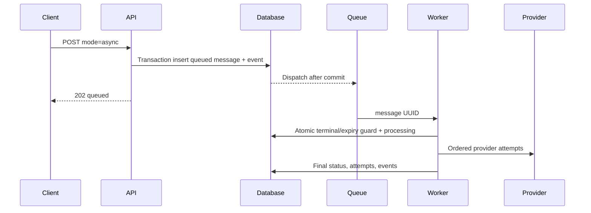

# UCIC UC-002 — Queue and process text asynchronously

Status: Reviewed  
Derived from: UC-002 0.1.0 and ENT-001–ENT-008

## Scope

- Actor: ACT-001 Client application, ACT-003 Queue worker
- Related pages: MOD-001, MOD-002
- Related entities: ENT-001–ENT-008
- Authentication/authorization: Same as UC-001 at ingress; worker is internal.

## Sequence



## Interface contract

| API/operation ID | Method/event | Path/topic/function | Auth | Idempotency |
|---|---|---|---|---|
| API-001 | POST | `/api/v1/messages` with `mode=async` | Bearer | Same as UC-001 |
| API-002 | GET | `/api/v1/messages/{uuid}` | Bearer same owner | Read-only |
| JOB-001 | Queue job | `DispatchGatewayMessage(messageId)` | Internal | Message state guard |
| INT-001 | Function | Provider driver | Internal | Attempt record |

### Request/input

Same schema as UC-001, with `mode=async`. `expires_at` optional for non-OTP and required for OTP.

### Success output

HTTP 202 after message/event are committed and job is scheduled after commit:

```json
{
  "data": {
    "id": "uuid",
    "status": "queued",
    "mode": "async",
    "duplicate": false,
    "created_at": "ISO-8601"
  },
  "request_id": "uuid"
}
```

### Error outputs

Ingress errors equal UC-001. Queue/provider errors occur after 202 and are visible through API-002/admin ledger. A worker retry on terminal/started-ambiguous state becomes no-op or outcome_unknown, never blind provider resend.

## Data mapping

UC-001 mapping applies. Queue payload maps only to `ENT-006.id`, not message body or credentials.

## Validation and business rules

| Rule ID | Layer | Rule | Error/result |
|---|---|---|---|
| BR-001 | API/database | one message/job per key | replay |
| BR-004 | worker | stale started/ambiguous does not resend | outcome_unknown/reconcile |
| BR-006 | worker | expiry checked before first and each fallback | expired |

## Observability and verification

Events: `queued`, `processing`, `attempt_started`, optional `fallback_started`, then `provider_accepted|failed|outcome_unknown|expired`. Verified by TC-015–TC-037.

## Validation record

Reviewed; database queue is MVP implementation choice and can be replaced by Redis without contract changes.
