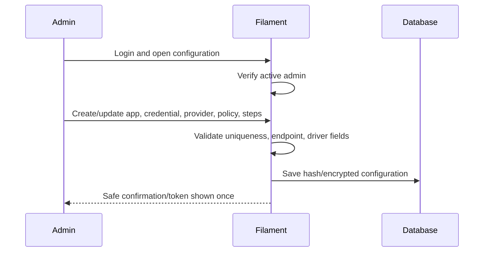

# UCIC UC-003 — Configure applications, providers, and routes

Status: Reviewed  
Derived from: UC-003 0.1.0 and ENT-001–ENT-005

## Scope

- Actor: ACT-002 Administrator
- Related pages: PAGE-001–PAGE-004
- Related entities: ENT-001–ENT-005
- Authentication/authorization: Filament session; `User.is_active && User.is_admin`.

## Sequence

## Interface contract

| API/operation ID | Method/event | Path/topic/function | Auth | Idempotency |
|---|---|---|---|---|
| UI-001 | CRUD/action | ClientApplication resource + token generation | Admin session + CSRF | Unique slug/token hash |
| UI-002 | CRUD | ProviderAccount resource | Admin session + CSRF | Unique slug |
| UI-003 | CRUD | RoutingPolicy resource | Admin session + CSRF | Unique scoped key |
| UI-004 | relation CRUD/reorder | RoutingStep manager | Admin session + CSRF | Unique policy position/provider |

### Request/input

Filament forms validate bounded names/slugs, active flags, driver-specific configuration, purpose, policy keys, dan route step positions. Provider configuration is write-only when editing: blank means keep existing secret.

### Success output

Saved resource and audit timestamps. Token create/rotate displays a generated `wgh_...` plaintext once; only hash/prefix remain after response lifecycle.

### Error outputs

| Condition | Status/code | Response | Recovery |
|---|---|---|---|
| Guest | redirect login | Filament login | Authenticate |
| Non-admin/inactive | 403 | Access denied | Admin updates user outside public UI |
| Invalid/duplicate config | validation | field errors | Correct fields |
| Unsafe provider URL | validation | endpoint rejected | Use approved HTTPS/internal WAHA host |

## Data mapping

Form values map directly to ENT-001–ENT-005 except token plaintext (hash only) and provider configuration (encrypted cast). Provider secret is never a table column exposed in list.

## Validation and business rules

NFR-001 applies at model, panel access, form, and view layers. Deleting referenced config uses soft delete/disable behavior.

## Observability and verification

Admin auth and secret persistence verified by TC-038–TC-041. Configuration changes have standard timestamps; full audit log is a post-MVP enhancement.

## Validation record

Reviewed against Filament 4 conventions and the approved MVP scope.
