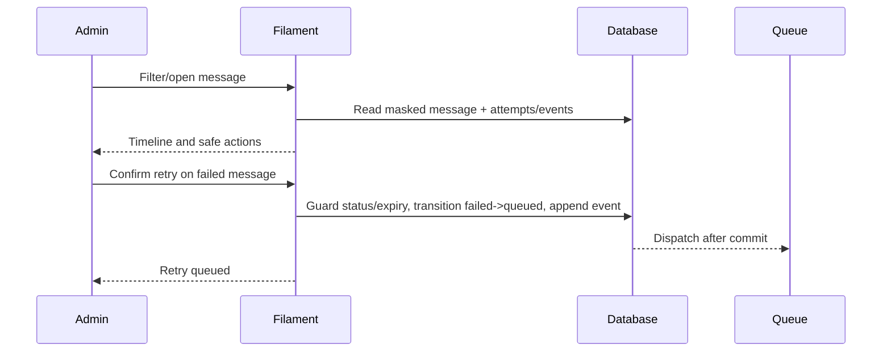

# UCIC UC-004 — Monitor and safely retry messages

Status: Reviewed  
Derived from: UC-004 0.1.0 and ENT-006–ENT-008

## Scope

- Actor: ACT-002 Administrator
- Related pages: PAGE-001, PAGE-005, PAGE-006
- Related entities: ENT-006–ENT-008
- Authentication/authorization: Active admin session.

## Sequence

## Interface contract

| API/operation ID | Method/event | Path/topic/function | Auth | Idempotency |
|---|---|---|---|---|
| UI-005 | View/action | Message resource detail + Retry | Admin + CSRF | State guard prevents duplicate retry |
| JOB-001 | Queue job | DispatchGatewayMessage | Internal | Terminal guard |

### Request/input

Filters: application, status, provider, purpose, date. Retry action accepts no arbitrary provider or body override; it reuses the recorded route and message only when status is `failed` and not expired.

### Success output

List masks recipient and body. Detail exposes message metadata, status timestamps, attempts, delivery certainty, retry disposition, latency, dan sanitized error. Successful retry transitions to queued and schedules JOB-001.

### Error outputs

| Condition | Status/code | Response | Recovery |
|---|---|---|---|
| accepted/queued/processing | action unavailable | no mutation | Wait/inspect |
| outcome_unknown | action unavailable | reconcile warning | Do not blind resend |
| expired | action unavailable | expiry warning | New business request/key |
| concurrent retry | state guard conflict | one job only | Refresh page |

## Data mapping

ENT-006 list fields map to masked display; ENT-007/ENT-008 map to read-only relation timeline. Retry appends an admin event and updates state; history is immutable.

## Validation and business rules

BR-004, BR-007, dan BR-008 apply. Retry never changes original idempotency key/payload hash and never deletes attempts.

## Observability and verification

TC-042–TC-044 cover access, timeline, safe retry, and prohibited retry states.

## Validation record

Reviewed; manual visual/browser verification follows executable Filament implementation.
